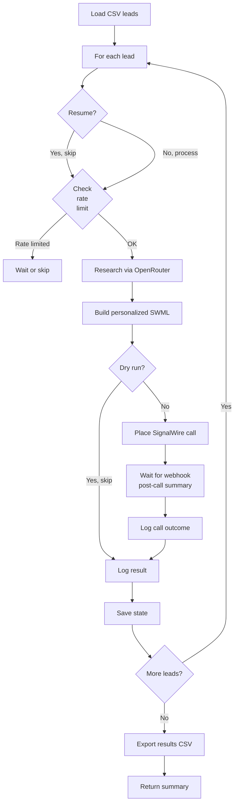

# Fortinet SLED Voice Campaign

**Name:** Fortinet SLED Voice Campaign  
**Description:** Autonomously research and call IT decision-makers at schools, cities, counties, and government agencies across South Dakota, Nebraska, and Iowa for Fortinet network security solutions.  
**Trigger:** CSV contact list (phone, name, account, notes)  
**Output:** Call log (JSONL), Call results (CSV with outcomes), Firestore records (optional)  

---

## Front Matter (OpenClaw Requirements)

```yaml
skill:
  id: fortinet-sled-voice-campaign
  name: Fortinet SLED Voice Campaign
  version: 1.0.0
  author: Samson Cirocco
  description: Research-powered batch voice calling with AI conversation for SLED prospect qualification
  
  # Execution mode
  execution_type: python
  entrypoint: skill_fortinet_sled_campaign.py
  timeout_seconds: 3600  # 1 hour per campaign (can handle ~15-20 calls)
  
  # Input format
  input_schema:
    type: object
    required: [csv_file, campaign_name]
    properties:
      csv_file:
        type: string
        description: "Path to CSV file with columns: phone, name, account, notes (all optional except phone)"
      campaign_name:
        type: string
        description: "Unique campaign identifier (e.g., 'sled-territory-832-march')"
      limit:
        type: integer
        description: "Max calls to place (default: all leads in CSV)"
        default: null
      interval_seconds:
        type: integer
        description: "Minimum seconds between calls (default: 30, required by rate limits)"
        default: 30
      business_hours_only:
        type: boolean
        description: "If true, pause outside 08:00-17:00 Central time (default: false)"
        default: false
      resume:
        type: boolean
        description: "If true, skip leads already processed in this campaign (default: false)"
        default: false
      dry_run:
        type: boolean
        description: "If true, research only—no calls placed (default: false)"
        default: false
      voice_lane:
        type: string
        enum: [A, B]
        description: "Lane A (openai.onyx, +16028985026) or Lane B (gcloud.en-US-Casual-K, +14806024668)"
        default: A
  
  # Environment variables required
  environment:
    required:
      - SIGNALWIRE_PROJECT_ID
      - SIGNALWIRE_AUTH_TOKEN
      - SIGNALWIRE_SPACE_URL
      - OPENROUTER_API_KEY
    optional:
      - OPENAI_API_KEY
      - WEBHOOK_DOMAIN
  
  # Resource requirements
  resources:
    memory_mb: 256
    cpu_cores: 1
    disk_gb: 2  # For state files, logs, research cache
    network: required
  
  # Output format
  output_schema:
    type: object
    properties:
      status:
        type: string
        enum: [success, partial_success, failed]
      calls_attempted:
        type: integer
      calls_placed:
        type: integer
      calls_failed:
        type: integer
      results_csv:
        type: string
        description: "Path to CSV with call results"
      call_log_jsonl:
        type: string
        description: "Path to JSONL log with post-call summaries"
      campaign_state:
        type: object
        description: "State file for resuming"
```

---

## Execution Flow



---

## Step-by-Step Execution

### 1. Load Configuration
- Read CSV file from input
- Load SignalWire credentials from environment
- Load API keys (OpenRouter, OpenAI)
- Validate phone numbers (normalize to E.164 format: +1XXXXXXXXXX)
- Skip invalid entries, log warnings

### 2. Rate Limit Check
- Before EACH call, check if cooldown period has passed
- If cooldown active (from 3 consecutive failures): SKIP this lead, log reason
- If call succeeded in last 30 seconds: WAIT until minimum interval passes
- If campaign hit 20 calls/hour: WAIT until hour window rolls over
- If campaign hit 100 calls/day: SKIP remaining leads, log daily limit reached

### 3. Research Phase (Per Lead)
- Query OpenRouter Perplexity/Sonar with account name + state + type
- Return JSON: contacts, hooks, pain_points, tech_intel, budget_cycle, conversation_starters
- Cache result locally (in case of re-runs)
- **On research failure:** Log error, skip call, continue to next lead

### 4. Build Personalized SWML
- Inject pre-call intel into prompt (hooks, pain points, tech intel)
- Set voice based on lane (A = openai.onyx, B = gcloud.en-US-Casual-K)
- Set from number based on lane (A = +16028985026, B = +14806024668)
- Set static greeting + prompt with personalized hooks

### 5. Place Call (SignalWire Compatibility API)
- POST to `/api/laml/2010-04-01/Accounts/{project_id}/Calls.json`
- Auth: Basic (base64 project_id:auth_token)
- Body (form-encoded): From, To, Url (internal agent), post_prompt_url (webhook)
- **On 200:** Call initiated; record call_id
- **On failure (422, 500, etc.):** Log error, retry logic (see error handling below)

### 6. Monitor Call
- Wait 20 seconds for call to initialize
- Check call status via GET (optional, to detect platform rate-limiting)
- Pattern: `status=failed, duration=0, sip=None` = platform rate-limited → trigger cooldown

### 7. Wait for Webhook (Post-Call Summary)
- Post-prompt URL: `https://hooks.6eyes.dev/voice-caller/post-call` (or custom domain)
- Webhook receives AI summary from SignalWire post_prompt
- Skill waits up to 30 seconds for webhook to arrive
- If timeout: log as "pending_summary" and move on (webhook may arrive later outside skill lifetime)

### 8. Log Results
- Write to `logs/call_summaries.jsonl` (one JSON per line)
- Write to campaign results CSV with columns: phone, name, account, call_status, call_id, duration, summary, timestamp
- Update campaign state file (for resume support)

### 9. Export & Return
- Generate summary:
  - Total leads: N
  - Calls attempted: X
  - Calls connected: Y
  - Failed: Z
  - Reason for failures (rate limit, API error, etc.)
- Return paths to results CSV and JSONL log
- Exit with status: success (all calls placed), partial_success (some placed, some failed), failed (no calls placed)

---

## Rate Limiting Implementation

### Stateful Rate Limiter

```json
{
  "campaign_name": "sled-territory-832-march",
  "last_call_timestamp": 1709551200,
  "calls_this_hour": 5,
  "calls_this_day": 15,
  "consecutive_failures": 0,
  "cooldown_until": null,
  "hourly_window_reset": 1709551200,
  "daily_window_reset": 1709500800
}
```

### Decision Tree

```
BEFORE EACH CALL:
  
  if (cooldown_until > now):
    → SKIP lead, log reason = "cooldown active"
    
  if (calls_this_hour >= 20 AND hourly_window < 1 hour old):
    → WAIT or SKIP until hour resets
    
  if (calls_this_day >= 100):
    → SKIP all remaining leads, log "daily limit reached"
    
  if (now - last_call_timestamp < 30 seconds):
    → WAIT (last_call_timestamp + 30) - now seconds
    
  THEN:
    → Place call
    → Increment calls_this_hour, calls_this_day
    → Update last_call_timestamp
    
IF CALL FAILS (status=failed, duration=0):
  ++ consecutive_failures
  if (consecutive_failures >= 3):
    cooldown_until = now + 300 seconds (5 minutes)
    consecutive_failures = 0
    
IF CALL SUCCEEDS:
  consecutive_failures = 0
```

---

## Error Handling & Recovery

| Error | Detection | Action |
|-------|-----------|--------|
| Invalid phone | Regex check | Skip lead, log "invalid_phone" |
| No CSV file | File check | Exit with error, return status=failed |
| Missing API key | Environment check | Exit with error on first research call |
| Research API timeout | Requests 30s timeout | Skip call, log "research_timeout" |
| Research API 429 (rate limit) | HTTP 429 | Backoff 60s, retry up to 2x |
| SignalWire 422 (invalid params) | HTTP 422 | Log SWML error, skip lead |
| SignalWire 500 | HTTP 500 | Retry after 60s, max 3 attempts |
| SignalWire 200 but 0 duration | Status check | Increment failure counter (rate limit detection) |
| Webhook timeout (30s) | Timer | Log as "pending_summary", continue (webhook may arrive async) |
| Filesystem I/O error | Exception handling | Log error, attempt to continue |

---

## Resumability

Campaign state saved after each call:

```json
{
  "campaign_name": "sled-territory-832-march",
  "created_at": "2026-03-03T10:00:00Z",
  "resumed_at": "2026-03-03T11:30:00Z",
  "csv_path": "campaigns/sled-territory-832.csv",
  "processed_indices": [0, 1, 2, 3, 5, 7],
  "skipped_indices": [4, 6],
  "calls_placed": 6,
  "rate_limit_state": { ... }
}
```

If user calls skill again with `resume=true`, skip all processed_indices and continue from where it left off.

---

## Dependencies

```
requests==2.31.0
python-dotenv==1.0.0 (optional but recommended)
```

---

## Example Usage (OpenClaw CLI)

```bash
# Research only, no calls
openclaw skill run fortinet-sled-voice-campaign \
  --csv-file campaigns/sled-territory-832.csv \
  --campaign-name test-march \
  --dry-run

# Run 10 calls with Lane A (municipal persona)
openclaw skill run fortinet-sled-voice-campaign \
  --csv-file campaigns/sled-territory-832.csv \
  --campaign-name territory-832-march \
  --limit 10 \
  --interval-seconds 30 \
  --voice-lane A

# Resume interrupted campaign
openclaw skill run fortinet-sled-voice-campaign \
  --csv-file campaigns/sled-territory-832.csv \
  --campaign-name territory-832-march \
  --resume

# Business hours only (08:00-17:00 Central)
openclaw skill run fortinet-sled-voice-campaign \
  --csv-file campaigns/sled-territory-832.csv \
  --campaign-name territory-832-march \
  --business-hours-only
```

---

## CSV Input Format

| Column | Type | Required | Example |
|--------|------|----------|---------|
| phone | string | Yes | `(602) 295-0104` or `+16022950104` |
| name | string | No | `John Smith` |
| account | string | No | `Aberdeen City Government` |
| notes | string | No | `Sheriff IT contact, E-Rate eligible` |

---

## Output Formats

### results.csv (call outcomes)
```
phone,name,account,call_status,call_id,duration_seconds,outcome,timestamp
+16022950104,,Aberdeen City,connected,abc123,125,Connected_Qualified,2026-03-03T10:05:00Z
+16025557890,Mike,Tripp-Delmont SD,failed,def456,0,Rate_Limited,2026-03-03T10:10:00Z
+16025551234,Jane,Pierre SD Education,connected,ghi789,95,Connected_Not_Interested,2026-03-03T11:00:00Z
```

### call_summaries.jsonl (post-call AI summaries)
```json
{"timestamp":"2026-03-03T10:06:15Z","call_id":"abc123","from":"+16028985026","to":"+16022950104","summary":"- Call outcome: Connected\n- Spoke with: John\n- Role: IT Manager\n- Organization: Aberdeen City\n- Current setup: VMware + Meraki firewalls\n- Interest level: 4\n- Follow-up: Email overview on Monday"}
```

---

## Success Criteria

- ✅ All leads processed (or rate limit prevents further calls)
- ✅ Calls placed match expected (accounting for rate limit, rejections)
- ✅ State file saved for resumability
- ✅ Results CSV generated with all call outcomes
- ✅ JSONL log contains parsed post-call summaries
- ✅ No uncaught exceptions in execution logs
- ✅ Skill returns within timeout (3600 seconds = 1 hour)
